# PR Locking Actions

A pair of GitHub Actions that implement a distributed locking mechanism for
coordinating workflows across multiple pull requests. These actions prevent
concurrent operations (like deployments) by using Git branches as locks.

## Overview

The PR Locking system consists of two complementary actions:

- **[acquire](./acquire)** - Acquires a lock before performing critical
  operations
- **[release](./release)** - Releases a lock when a PR is closed or merged

Together, these actions ensure that only one PR can hold a specific lock at a
time, preventing race conditions and conflicts in deployment pipelines or other
critical workflows.

## Table of Contents

- [Quick Start](#quick-start)
- [How It Works](#how-it-works)
- [Complete Workflow Examples](#complete-workflow-examples)
- [Configuration Options](#configuration-options)
- [Best Practices](#best-practices)
- [Troubleshooting](#troubleshooting)
- [Advanced Usage](#advanced-usage)

## Quick Start

### Basic Setup

Add this workflow to your repository to implement PR-based locking:

```yaml
name: Deploy with Lock
on:
  pull_request:
    types: [opened, synchronize, reopened, closed]

jobs:
  deploy:
    if: github.event.action != 'closed'
    runs-on: ubuntu-latest
    permissions:
      contents: write
      checks: write
      pull-requests: write
    steps:
      - uses: actions/checkout@v4
        with:
          fetch-depth: 0

      - name: Acquire deployment lock
        uses: smartcontractkit/.github/actions/pr-locking/acquire@main
        with:
          lock: production-deploy-lock
          pr: ${{ github.event.pull_request.number }}

      - name: Deploy to production
        run: |
          echo "Deploying..."
          # Your deployment commands here

  release-lock:
    if: github.event.action == 'closed'
    runs-on: ubuntu-latest
    permissions:
      contents: write
      pull-requests: write
    steps:
      - uses: actions/checkout@v4
        with:
          fetch-depth: 0

      - name: Release deployment lock
        uses: smartcontractkit/.github/actions/pr-locking/release@main
        with:
          lock: production-deploy-lock
```

## How It Works

### Lock Acquisition Flow

```mermaid
flowchart TD
    A["🔄 PR triggers workflow"] --> B{"Lock branch<br/>exists?"}
    B -->|"❌ No"| C["📝 Create lock branch"]
    C --> D["💾 Write PR number<br/>to LOCK_PR file"]
    D --> E["⬆️ Push lock branch"]
    E --> F["✅ Lock acquired<br/>Continue workflow"]

    B -->|"✓ Yes"| G["📥 Fetch lock branch"]
    G --> H["📖 Read LOCK_PR file"]
    H --> I{"Same PR<br/>number?"}
    I -->|"✓ Yes"| F
    I -->|"❌ No"| J["🚫 Lock held by<br/>another PR"]
    J --> K["💬 Post blocking<br/>comment to PR"]
    K --> L["⚠️ Create failed<br/>status check"]
    L --> M["🛑 Exit workflow"]

    style F fill:#90EE90
    style M fill:#FFB6C1
    style J fill:#FFD700
```



### Lock Release Flow

```mermaid
flowchart TD
    A["🔒 PR closed/merged"] --> B{"Lock branch<br/>exists?"}
    B -->|"❌ No"| C["ℹ️ Nothing to do<br/>Exit"]

    B -->|"✓ Yes"| D["📥 Fetch lock branch"]
    D --> E["📖 Read LOCK_PR file"]
    E --> F{"This PR<br/>owns lock?"}
    F -->|"❌ No"| C
    F -->|"✓ Yes"| G["🗑️ Delete lock branch"]
    G --> H{"Cleanup<br/>enabled?"}
    H -->|"✓ Yes"| I["🔍 Find blocking comments<br/>on other PRs"]
    I --> J["🧹 Delete blocking<br/>comments"]
    J --> K["✅ Lock released"]
    H -->|"❌ No"| K

    style K fill:#90EE90
    style C fill:#E0E0E0
```



## Complete Workflow Examples

### Example 1: Simple Deployment Lock

Prevent concurrent deployments to a single environment:

```yaml
name: Deploy to Staging
on:
  pull_request:
    types: [opened, synchronize, reopened, closed]

jobs:
  deploy:
    if: github.event.action != 'closed'
    runs-on: ubuntu-latest
    permissions:
      contents: write
      checks: write
      pull-requests: write
    steps:
      - uses: actions/checkout@v4
        with:
          fetch-depth: 0

      - name: Acquire staging lock
        uses: smartcontractkit/.github/actions/pr-locking/acquire@main
        with:
          lock: staging-deploy-lock
          pr: ${{ github.event.pull_request.number }}
          message_action: Deployment

      - name: Build application
        run: npm run build

      - name: Deploy to staging
        run: ./scripts/deploy.sh staging

  release-lock:
    if: github.event.action == 'closed'
    runs-on: ubuntu-latest
    permissions:
      contents: write
      pull-requests: write
    steps:
      - uses: actions/checkout@v4
        with:
          fetch-depth: 0

      - name: Release staging lock
        uses: smartcontractkit/.github/actions/pr-locking/release@main
        with:
          lock: staging-deploy-lock
```

### Example 2: Multiple Environment Locks

Use different locks for different environments:

```yaml
name: Multi-Environment Deploy
on:
  pull_request:
    types: [opened, synchronize, reopened, closed]

jobs:
  deploy-staging:
    if: github.event.action != 'closed'
    runs-on: ubuntu-latest
    permissions:
      contents: write
      checks: write
      pull-requests: write
    steps:
      - uses: actions/checkout@v4
        with:
          fetch-depth: 0

      - name: Acquire staging lock
        uses: smartcontractkit/.github/actions/pr-locking/acquire@main
        with:
          lock: staging-lock
          pr: ${{ github.event.pull_request.number }}

      - name: Deploy to staging
        run: ./scripts/deploy.sh staging

  deploy-production:
    if:
      github.event.action != 'closed' && github.event.pull_request.base.ref ==
      'main'
    needs: deploy-staging
    runs-on: ubuntu-latest
    permissions:
      contents: write
      checks: write
      pull-requests: write
    steps:
      - uses: actions/checkout@v4
        with:
          fetch-depth: 0

      - name: Acquire production lock
        uses: smartcontractkit/.github/actions/pr-locking/acquire@main
        with:
          lock: production-lock
          pr: ${{ github.event.pull_request.number }}

      - name: Deploy to production
        run: ./scripts/deploy.sh production

  release-locks:
    if: github.event.action == 'closed'
    runs-on: ubuntu-latest
    permissions:
      contents: write
      pull-requests: write
    strategy:
      matrix:
        lock: [staging-lock, production-lock]
    steps:
      - uses: actions/checkout@v4
        with:
          fetch-depth: 0

      - name: Release ${{ matrix.lock }}
        uses: smartcontractkit/.github/actions/pr-locking/release@main
        with:
          lock: ${{ matrix.lock }}
```

### Example 3: Database Migration Lock

Ensure only one PR runs database migrations at a time:

```yaml
name: Database Migration
on:
  pull_request:
    types: [opened, synchronize, reopened, closed]

jobs:
  migrate:
    if: github.event.action != 'closed'
    runs-on: ubuntu-latest
    permissions:
      contents: write
      checks: write
      pull-requests: write
    steps:
      - uses: actions/checkout@v4
        with:
          fetch-depth: 0

      - name: Acquire migration lock
        uses: smartcontractkit/.github/actions/pr-locking/acquire@main
        with:
          lock: db-migration-lock
          pr: ${{ github.event.pull_request.number }}
          message_action: Migration

      - name: Run database migrations
        run: |
          npm run migrate:up
          npm run seed:test-data

  release-lock:
    if: github.event.action == 'closed'
    runs-on: ubuntu-latest
    permissions:
      contents: write
      pull-requests: write
    steps:
      - uses: actions/checkout@v4
        with:
          fetch-depth: 0

      - name: Release migration lock
        uses: smartcontractkit/.github/actions/pr-locking/release@main
        with:
          lock: db-migration-lock
          message_action: Migration
```

### Example 4: Conditional Lock with Output

Use lock acquisition output to conditionally run steps:

```yaml
name: Conditional Deployment
on:
  pull_request:
    types: [opened, synchronize, reopened, closed]

jobs:
  deploy:
    if: github.event.action != 'closed'
    runs-on: ubuntu-latest
    permissions:
      contents: write
      checks: write
      pull-requests: write
    steps:
      - uses: actions/checkout@v4
        with:
          fetch-depth: 0

      - name: Acquire deployment lock
        id: lock
        uses: smartcontractkit/.github/actions/pr-locking/acquire@main
        with:
          lock: deploy-lock
          pr: ${{ github.event.pull_request.number }}

      - name: Show lock status
        run: |
          echo "Lock acquired: ${{ steps.lock.outputs.lock_acquired }}"
          echo "Lock owner: ${{ steps.lock.outputs.lock_owner }}"

      - name: Deploy (only if lock acquired)
        if: steps.lock.outputs.lock_acquired == 'true'
        run: ./deploy.sh

      - name: Notify if blocked
        if: steps.lock.outputs.lock_acquired == 'false'
        run: |
          echo "Deployment blocked by PR #${{ steps.lock.outputs.lock_owner }}"

  release-lock:
    if: github.event.action == 'closed'
    runs-on: ubuntu-latest
    permissions:
      contents: write
      pull-requests: write
    steps:
      - uses: actions/checkout@v4
        with:
          fetch-depth: 0

      - name: Release lock
        uses: smartcontractkit/.github/actions/pr-locking/release@main
        with:
          lock: deploy-lock
```

## Configuration Options

### Acquire Action Inputs

| Input            | Required | Default                            | Description                                         |
| ---------------- | -------- | ---------------------------------- | --------------------------------------------------- |
| `lock`           | Yes      | -                                  | The name of the lock to acquire                     |
| `pr`             | No       | `github.event.pull_request.number` | The PR number that will own the lock                |
| `message_action` | No       | `"Deployment"`                     | The action name shown in status checks and comments |

### Acquire Action Outputs

| Output          | Description                                        |
| --------------- | -------------------------------------------------- |
| `lock_acquired` | `'true'` if lock was acquired, `'false'` otherwise |
| `lock_owner`    | The PR number that owns the lock                   |

### Release Action Inputs

| Input              | Required | Default                            | Description                                        |
| ------------------ | -------- | ---------------------------------- | -------------------------------------------------- |
| `lock`             | Yes      | -                                  | The name of the lock to release                    |
| `pr`               | No       | `github.event.pull_request.number` | The PR number attempting to release the lock       |
| `cleanup_comments` | No       | `"true"`                           | Whether to delete blocking comments from other PRs |
| `message_action`   | No       | `"Deployment"`                     | The action name to match when cleaning comments    |

## Best Practices

### 1. Use Descriptive Lock Names

```yaml
# Good - Clear and specific
lock: production-database-migration-lock
lock: staging-deployment-lock
lock: integration-test-environment-lock

# Bad - Vague or generic
lock: lock
lock: my-lock
lock: test
```

### 2. Always Set Proper Permissions

```yaml
permissions:
  contents: write # Required to create/delete lock branches
  checks: write # Required for status checks
  pull-requests: write # Required for PR comments
```

### 3. Use fetch-depth: 0

Always checkout with full history to avoid Git issues:

```yaml
- uses: actions/checkout@v4
  with:
    fetch-depth: 0 # Important!
```

### 4. Customize Message Action

Make blocking messages clear by setting `message_action`:

```yaml
- uses: smartcontractkit/.github/actions/pr-locking/acquire@main
  with:
    lock: db-lock
    message_action: Database Migration # Shows "Database Migration blocked"
```

### 5. Handle Lock Release on All PR Closures

Ensure locks are released whether PR is merged or closed:

```yaml
on:
  pull_request:
    types: [opened, synchronize, reopened, closed] # Include 'closed'!
```

### 6. Use Matrix Strategy for Multiple Locks

Release multiple locks efficiently:

```yaml
strategy:
  matrix:
    lock: [staging-lock, production-lock, db-lock]
steps:
  - uses: smartcontractkit/.github/actions/pr-locking/release@main
    with:
      lock: ${{ matrix.lock }}
```

## Troubleshooting

### Issue: Lock Not Being Released

**Symptoms**: Lock branch remains after PR is closed

**Solutions**:

1. Verify the `closed` event is included in workflow triggers:

   ```yaml
   on:
     pull_request:
       types: [opened, synchronize, reopened, closed]
   ```

2. Check permissions:

   ```yaml
   permissions:
     contents: write
     pull-requests: write
   ```

3. Manually delete the lock:
   ```bash
   git push origin --delete <lock-name>
   ```

### Issue: "Lock branch exists" Error

**Symptoms**: Action fails because another PR holds the lock

**This is expected behavior!** The action is designed to block concurrent
operations. Wait for the other PR to be merged/closed, or manually release the
lock if needed.

### Issue: Comments Not Being Cleaned Up

**Symptoms**: Blocking comments remain on PRs after lock is released

**Solutions**:

1. Verify `cleanup_comments` is set to `"true"` (it's the default)
2. Check that `message_action` matches between acquire and release
3. Ensure `pull-requests: write` permission is set

### Issue: Permission Denied

**Symptoms**: `403 Forbidden` or permission errors

**Solutions**:

1. Verify all required permissions are set
2. For organization repos, check branch protection rules

### Issue: Git Fetch Errors

**Symptoms**: `fatal: couldn't find remote ref` or similar

**Solutions**:

1. Use `fetch-depth: 0` in checkout
2. Ensure Git is configured:
   ```yaml
   - run: |
       git config user.name "github-actions[bot]"
       git config user.email "github-actions[bot]@users.noreply.github.com"
   ```

## Advanced Usage

### Manual Lock Management

You can manually manage locks using Git commands:

```bash
# Check if a lock exists
git ls-remote --heads origin my-lock

# See who holds the lock
git fetch origin my-lock:my-lock
git show my-lock:LOCK_PR

# Manually release a lock
git push origin --delete my-lock
```

### Create Lock via Workflow Dispatch

```yaml
name: Manual Lock Control
on:
  workflow_dispatch:
    inputs:
      action:
        type: choice
        options: [acquire, release]
        required: true
      lock_name:
        required: true
      pr_number:
        required: true

jobs:
  manage-lock:
    runs-on: ubuntu-latest
    steps:
      - uses: actions/checkout@v4
        with:
          fetch-depth: 0

      - name: Acquire lock
        if: github.event.inputs.action == 'acquire'
        uses: smartcontractkit/.github/actions/pr-locking/acquire@main
        with:
          lock: ${{ github.event.inputs.lock_name }}
          pr: ${{ github.event.inputs.pr_number }}

      - name: Release lock
        if: github.event.inputs.action == 'release'
        uses: smartcontractkit/.github/actions/pr-locking/release@main
        with:
          lock: ${{ github.event.inputs.lock_name }}
          pr: ${{ github.event.inputs.pr_number }}
```

### Using Locks with Environments

Combine with GitHub Environments for additional control:

```yaml
jobs:
  deploy-production:
    runs-on: ubuntu-latest
    environment:
      name: production
      url: https://production.example.com
    permissions:
      contents: write
      checks: write
      pull-requests: write
    steps:
      - uses: actions/checkout@v4
        with:
          fetch-depth: 0

      - name: Acquire production lock
        uses: smartcontractkit/.github/actions/pr-locking/acquire@main
        with:
          lock: production-lock

      - name: Deploy
        run: ./deploy.sh
```

### Lock Timeout Pattern

Implement a timeout to prevent indefinite blocking:

```yaml
jobs:
  deploy:
    runs-on: ubuntu-latest
    timeout-minutes: 30 # Fail if lock not acquired within 30 min
    steps:
      - uses: actions/checkout@v4
        with:
          fetch-depth: 0

      - name: Wait and retry lock acquisition
        uses: smartcontractkit/.github/actions/pr-locking/acquire@main
        with:
          lock: deploy-lock
```

## How Locks Work Internally

Locks are implemented using Git branches with the following structure:

```
Lock Branch: <lock-name>
├── LOCK_PR (file containing PR number)
└── Commit message: "Lock held by PR #123"
```

**Why Git branches?**

- Atomic creation (Git ensures only one branch can be created)
- Distributed and reliable
- No external infrastructure required
- Native GitHub integration

## Requirements

- GitHub Actions environment
- `contents: write` permission (for creating/deleting branches)
- `checks: write` permission (for status checks)
- `pull-requests: write` permission (for comments)
- GitHub CLI (`gh`) available in runner (default in `ubuntu-latest`)

## License

MIT

## Author

@smartcontractkit
