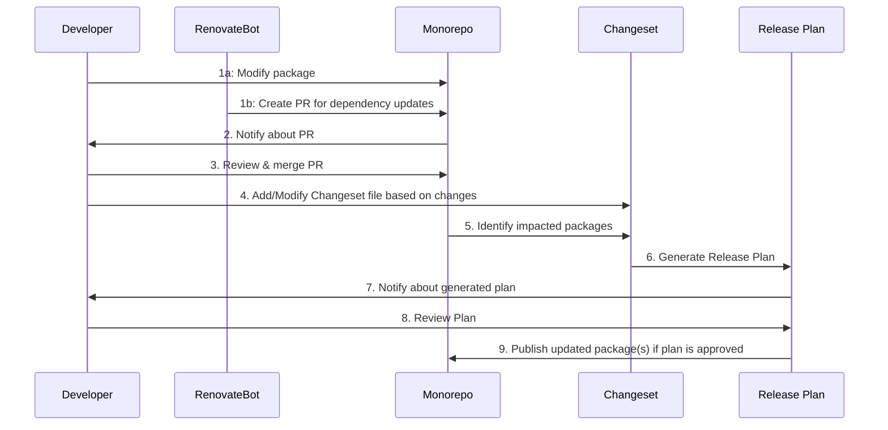

# update-actions

> update-actions

## Action package updates within .github monorepo



- **1a:** The `Developer` creates a PR for manual package updates.
- **1b:** The `RenovateBot` creates a PR for dependency updates.
- **2:** The `Monorepo` system notifies the `Developer` about the PR w/
  PolicyBot.
- **3:** The `Developer` reviews and merges the PR.
- **4:** The `Developer` adds or modifies the changeset file based on the
  changes made.
- **5:** The `Monorepo` identifies the impacted packages.
- **6:** A `Changeset` is used to generate a `Release Plan`.
- **7:** The `Release Plan` system notifies the `Developer` about the generated
  plan.
- **8:** The `Developer` reviews the plan.
- **9:** If the plan is approved, the `Release Plan` instructs the Monorepo to
  publish the updated package(s).

## Action package updates within application repos

Github actions updater uses a pull mechanism to update custom github actions.
The schedule workflow lives in the application repo and requires the following
permissions (see example
[here](https://github.com/smartcontractkit/releng-go-app/blob/main/.github/workflows/schedule-update-actions.yml)):

- contents: write (make updates to app repo / read tags for .github)
- pull_requests: write (create pull requests in app repo)
- workflows: write (update workflows in app repo)

There are a few ways to reference actions:

- locally: `./actions/ci-lint-go`
- ref (branch/tag): `smartcontractkit/.github/actions/ci-lint-go@main`
- ref (shasum) + comment:
  `smartcontractkit/.github/actions/ci-lint-go@<shasum> # vx.x.x`

If a custom action referenced from this repo includes a comment with a monorepo
tag and valid semver version, it will update to the latest semver version. The
comment should be in this format: `# <action-name>@<action-version>`. (see
monorepo tags [here](https://github.com/smartcontractkit/.github/tags)) Any
other non-semver reference is ignored. For example:

- action used in workflow (before):

```yaml
uses: smartcontractkit/.github/actions/ci-lint-go@<shasum-before> # ci-lint-go@x.x.x
```

- action used in workflow (after):

```yaml
uses: smartcontractkit/.github/actions/ci-lint-go@<shasum-after> # ci-lint-go@x.x.y
```

To bootstrap an action to accept action updates, add `# @0.0.0` with any valid
reference and the action updater will update at the next scheduled run.

```yaml
uses: smartcontractkit/.github/actions/ci-lint-go@<any-valid-ref> # @0.0.0
```
