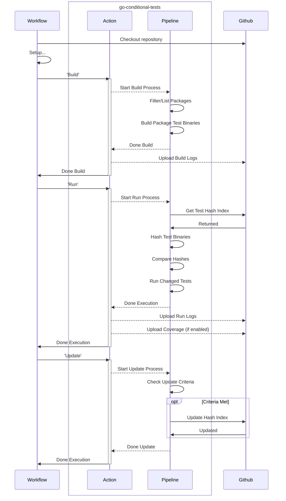

# go-conditional-tests

An action that maintains an index of golang unit test binaries, and can
conditionally execute those binaries when changed.



### Hash Index

The hash index is a mapping of import path to hash. It allows you to verify if a
test package has been modified since it's last successful run.

The hash index is saved on a per branch and commit basis, and is saved to the
Github Actions cache.

1. There should be a source of truth index for each commit the default branch of
   your repository.
2. New PRs will restore from the default (or target) branch's most recent cache
   entry.
   1. Upon an initial completion of the tests, the PR branch will create it's
      own cache entry.
3. As existing PRs are updated, it will restore from that branch's previous
   cache entry and will add a new cache entry upon a successful completion.

## Usage

Example workflow job:

```
run-unit-tests:
  name: Unit Tests
  needs: filter
  runs-on: ubuntu-latest
  permissions:
    id-token: write
    contents: write
    actions: write
  steps:
    - name: Checkout the repo
      uses: actions/checkout@v4.2.1

    - name: Setup
      ...

    - name: Build Tests
      uses: smartcontractkit/.github/apps/go-conditional-tests@<version>
      timeout-minutes: 10
      with:
        pipeline-step: "build"
        test-suite: "unit"
        module-directory: "./module"
        github-token: ${{ secrets.GITHUB_TOKEN }}

    - name: Run Tests
      uses: smartcontractkit/.github/apps/go-conditional-tests@<version>
      timeout-minutes: 15
      env:
        CL_DATABASE_URL: ${{ env.DB_URL }}
      with:
        pipeline-step: "run"
        test-suite: "unit"
        module-directory: "./module"
        github-token: ${{ secrets.GITHUB_TOKEN }}

    - name: Update Test Index
      uses: smartcontractkit/.github/apps/go-conditional-tests@<version>
      timeout-minutes: 2
      with:
        pipeline-step: "update"
        test-suite: "unit"
        github-token: ${{ secrets.GITHUB_TOKEN }}
```

## Action

### Inputs

#### Behavioral Inputs

- `pipeline-step`, `build / run / update / e2e`
  - Describes which step of the pipeline to perform. This allows you to separate
    the action into multiple steps of a job.
  - `build` - finds all the packages and builds the test binary for each
  - `run` - given the output from `build`, will hash the binaries, compare those
    to the hash index, then run those that have changed.
  - `update` - given the output from `run`, it will update the hash index with
    the new indexes.
  - `e2e` - performs all of the above as a single step.

### General Inputs

- `test-suite`
  - The name of the test suite, used to scope artifacts and the test indexes
- `module-directory`, path (`./`)
  - The path to the root module for the tests. Similar to setting
    `working-directory`.
- `collect-coverage`, true / **false**
  - Enables the `build`, and `run` flags for collecting coverage. Then uploads
    the coverage files. This will also enable `run-all-tests` and should skip
    the update step. This is because the update step should not use hashes from
    binaries built with the coverage parameters.

#### `build` inputs

- `build-concurrency`, number (`8`)
  - The amount of concurrent builds when building the test binaries. Recommended
    to be the number of available CPU cores.
- `build-flags`: string (`""`)
  - CLI build flags to pass to the `go test -c ...` command when building the
    test binaries

#### `run` inputs

- `run-all-tests`: true / **false**
  - Runs every test binary built, ignoring the normal behaviour of conditional
    execution based on the different hashes.
- `run-concurrency`, number (`8`)
  - The amount of concurrent running tests.

### Other Inputs

- `github-token`
  - Used by `run` and `update` steps to authenticate to github to fetch/update
    the test hash index.

### TODO

- Support for config files so not everything has to be passed directly to the
  action
- Scrub logs
- Update the hash index of only successful tests
