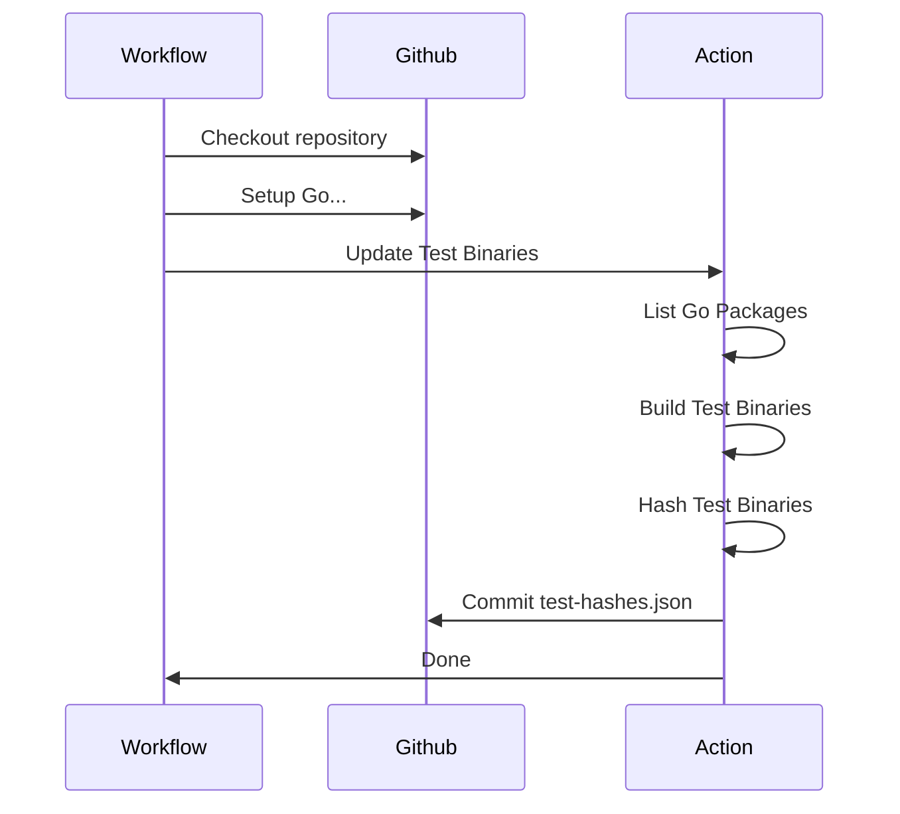
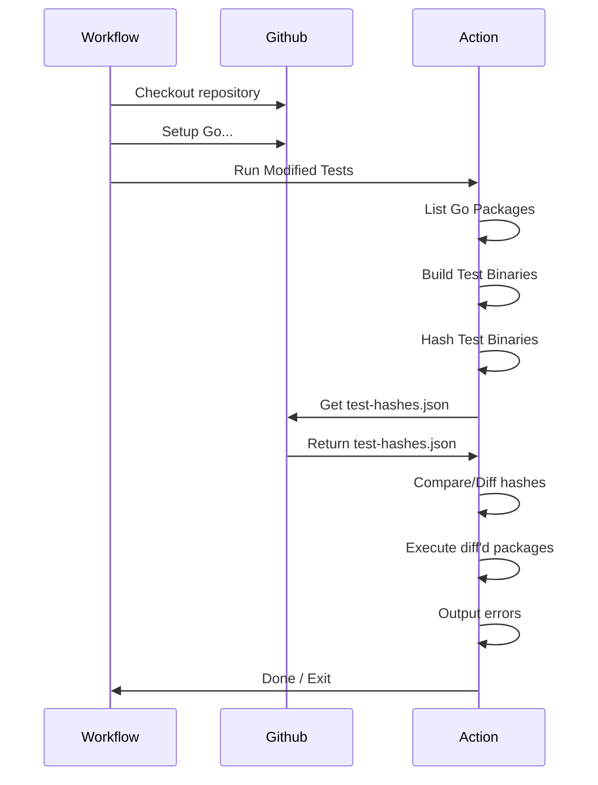

# go-test-caching

An action that maintains an index of golang unit test binaries, and can
conditionally execute those binaries when changed.

It has two major modes of operation

- Update index
- Run tests

### Update index

Should only be run on a push to the default branch.

### Run modified tests

Can be run on pull-requests, or push events.

The caveat that on the push to the default branch, it should be run concurrently
or before the update index job. As if the index is updated prior to the
comparison, then nothing would ever run.

## Action

### Inputs

#### Behavioral Inputs

- `pipeline-step`, `build / run / update / e2e`
  - Describes which step of the pipeline to perform. This allows you to separate
    the action into multiple steps of a job.
  - `build` - finds all the packages and builds the test binary for each
  - `run` - given the output from `build`, will hash the binaries, compare those
    to the hash index, then run those that have changed.
  - `update` - given the output from `run`, it will update the hash index with
    the new indexes
  - `e2e` - performs all of the above as a single step.

### General Inputs

- `test-suite`
  - The name of the test suite, used to scope artifacts and the test indexes
- `module-directory`, path (`./`)
  - The path to the root module for the tests. Similar to setting
    `working-directory`.
- `hashes-branch`, string (`test-hashes`)
  - The (ideally orphaned) git branch to store the test hash index json files
    on. Used by `run` and `update`.

#### `build` inputs

- `build-concurrency`, number (`8`)
  - The amount of concurrent builds when building the test binaries. Recommended
    to be the number of available CPU cores.
- `build-flags`: string (`""`)
  - CLI build flags to pass to the `go test -c ...` command when building the
    test binaries

#### `run` inputs

- `run-all-tests`: true / **false**
  - Runs every test binary built, ignoring the normal behaviour of conditional
    execution based on the different hashes.
- `run-concurrency`, number (`8`)
  - The amount of concurrent running tests.

#### `update` inputs

- `force-update-index`, true / **false**
  - Allows you to force an update even if not on the default branch.

### Other Inputs

- `github-token`
  - Used by `run` and `update` steps to authenticate to github to fetch/update
    the test hash index.

### TODO

- Support for config files so not everything has to be passed directly to the
  action?
- Run flags
  - Code coverage
- Ignore certain directories?
- Scrub logs?
- Update the hash index of only successful tests?
