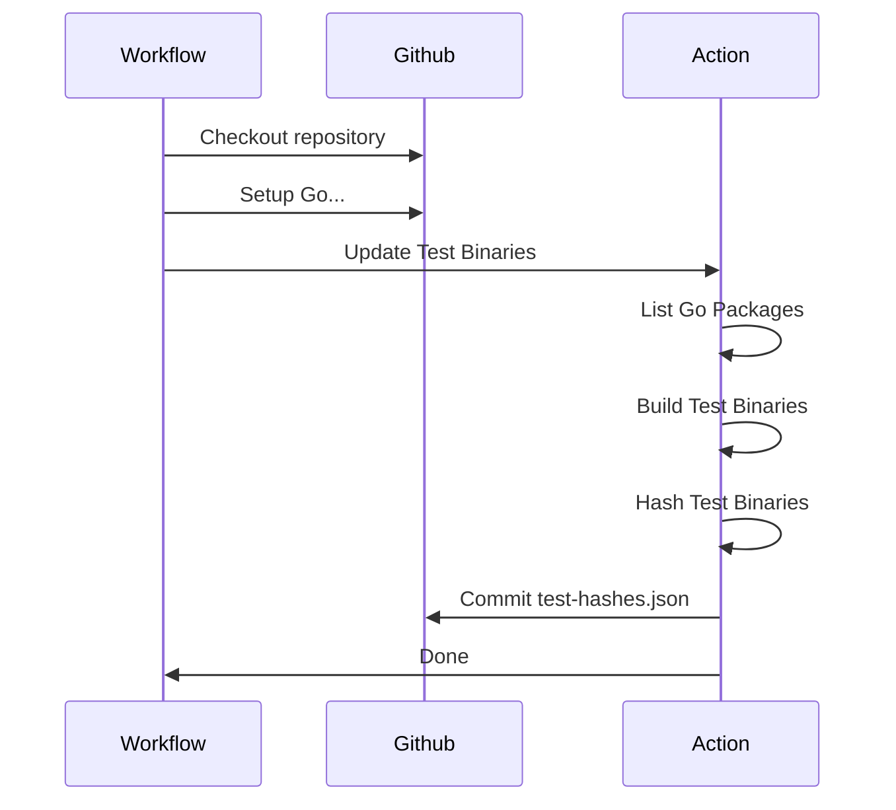
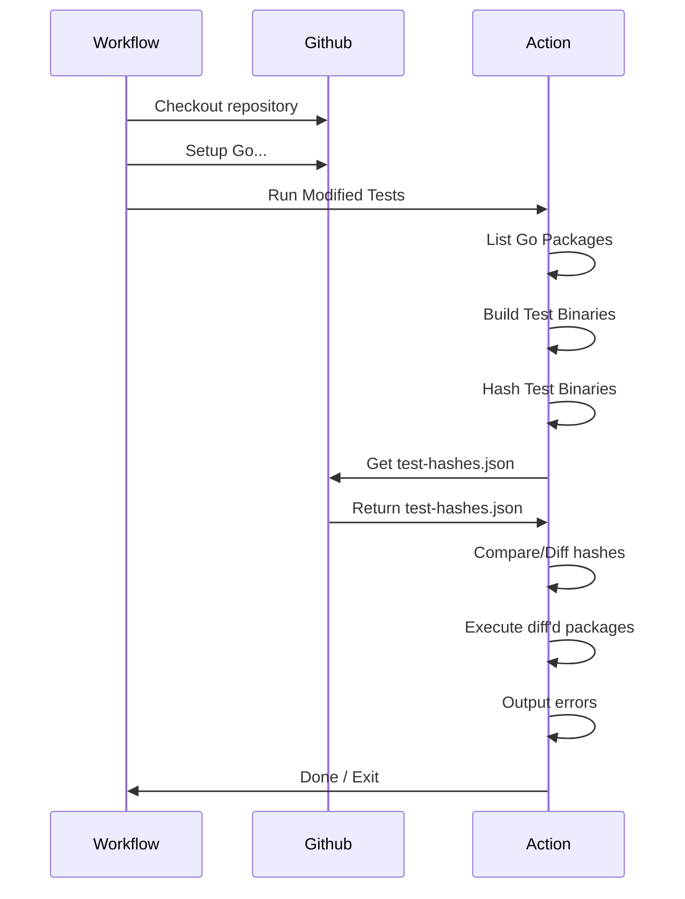

# go-test-caching

An action that maintains an index of golang unit test binaries, and can
conditionally execute those binaries when changed.

It has two major modes of operation

- Update index
- Run tests

### Update index

Should only be run on a push to the default branch.

### Run modified tests

Can be run on pull-requests, or push events.

The caveat that on the push to the default branch, it should be run concurrently
or before the update index job. As if the index is updated prior to the
comparison, then nothing would ever run.

## Action

### Inputs

#### Behavioral Inputs

- `update-index`, true / **false**
  - Will update the test index after building, hashing, and successfully running
    all new tests. Only if on the repo's default branch
- `force-update-index`, true / **false**
  - Requires `update-index` to also be true. Allows you to force an update even
    if not on the default branch. Still requires successful execution of all new
    tests.
- `tag-filter`: string (`""`)
  - limits the tests to packages/files with the `//go:build <tag>` directive
  - performs a find on all `*_test.go` files, and will limit builds and runs to
    those.
- `run-all-tests`: true / **false**
  - Runs every test binary built, ignoring the normal behaviour of conditional
    execution based on the different hashes.

### General Inputs

- `module-directory`, path (`./`)
  - The path to the root module for the tests. Similar to setting
    `working-directory`.
- `test-suite`
  - The name of the test suite, used to scope artifacts and the test indexes
- `build-flags`: string (`""`)
  - CLI build flags to pass to the `go test -c ...` command when building the
    test binaries
  - `-tags <tag>` is added implicitly when `tag-filter` is passed.
- `hashes-branch`, string (`test-hashes`)
  - The (ideally orphaned) git branch to store the test hash index json files
    on.

### Other Inputs

- `build-concurrency`, number (`8`)
  - The amount of concurrent builds when building the test binaries. Recommended
    to be the number of available CPU cores.
- `run-concurrency`, number (`8`)
  - The amount of concurrent running tests. Recommended to be the number of
    available CPU cores.

### TODO

- Support for config files so not everything has to be passed directly to the
  action
- Run flags
  - Code coverage
- Ignore certain directories?
- Scrub logs?

### Features

- Stderr logs
- Build / Run logging artifacts uploaded
  - Scoped to each individual build/run
-
