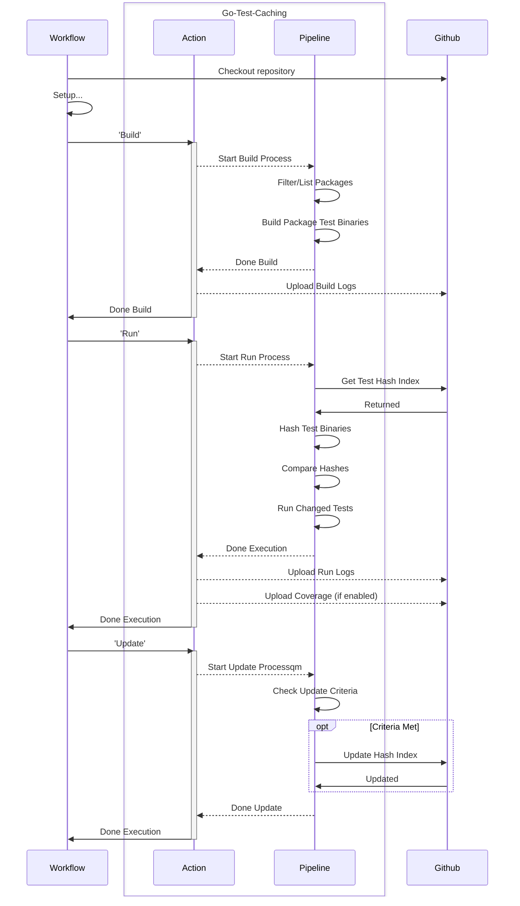

# go-test-caching

An action that maintains an index of golang unit test binaries, and can
conditionally execute those binaries when changed.



## Usage

Example workflow job:

```
run-unit-tests:
  name: Unit Tests
  needs: filter
  runs-on: ubuntu-latest
  permissions:
    id-token: write
    contents: write
  steps:
    - name: Checkout the repo
      uses: actions/checkout@v4.2.1

    - name: Setup
      ...

    - name: Build Tests
      uses: smartcontractkit/.github/apps/go-test-caching@<version>
      timeout-minutes: 10
      with:
        pipeline-step: "build"
        test-suite: "unit"
        module-directory: "./module"
        github-token: ${{ secrets.GITHUB_TOKEN }}

    - name: Run Tests
      uses: smartcontractkit/.github/apps/go-test-caching@<version>
      timeout-minutes: 15
      env:
        CL_DATABASE_URL: ${{ env.DB_URL }}
      with:
        pipeline-step: "run"
        test-suite: "unit"
        module-directory: "./module"
        github-token: ${{ secrets.GITHUB_TOKEN }}

    - name: Update Test Index
      uses: smartcontractkit/.github/apps/go-test-caching@<version>
      timeout-minutes: 2
      with:
        pipeline-step: "update"
        test-suite: "unit"
        github-token: ${{ secrets.GITHUB_TOKEN }}
```

## Action

### Inputs

#### Behavioral Inputs

- `pipeline-step`, `build / run / update / e2e`
  - Describes which step of the pipeline to perform. This allows you to separate
    the action into multiple steps of a job.
  - `build` - finds all the packages and builds the test binary for each
  - `run` - given the output from `build`, will hash the binaries, compare those
    to the hash index, then run those that have changed.
  - `update` - given the output from `run`, it will update the hash index with
    the new indexes, if on the repo's main branch.
  - `e2e` - performs all of the above as a single step.

### General Inputs

- `test-suite`
  - The name of the test suite, used to scope artifacts and the test indexes
- `module-directory`, path (`./`)
  - The path to the root module for the tests. Similar to setting
    `working-directory`.
- `hashes-branch`, string (`test-hashes`)
  - The (ideally orphaned) git branch to store the test hash index json files
    on. Used by `run` and `update`.
- `collect-coverage`, true / **false**
  - Enables the `build`, and `run` flags for collecting coverage. Then uploads
    the coverage files. This will also enable `run-all-tests` and should skip
    the update step. This is because the update step should not use hashes from
    binaries built with the coverage parameters.

#### `build` inputs

- `build-concurrency`, number (`8`)
  - The amount of concurrent builds when building the test binaries. Recommended
    to be the number of available CPU cores.
- `build-flags`: string (`""`)
  - CLI build flags to pass to the `go test -c ...` command when building the
    test binaries

#### `run` inputs

- `run-all-tests`: true / **false**
  - Runs every test binary built, ignoring the normal behaviour of conditional
    execution based on the different hashes.
- `run-concurrency`, number (`8`)
  - The amount of concurrent running tests.

#### `update` inputs

- `force-update-index`, true / **false**
  - Allows you to force an update even if not on the default branch.

### Other Inputs

- `github-token`
  - Used by `run` and `update` steps to authenticate to github to fetch/update
    the test hash index.

### TODO

- Support for config files so not everything has to be passed directly to the
  action?
- Ignore certain directories?
- Scrub logs?
- Update the hash index of only successful tests?
